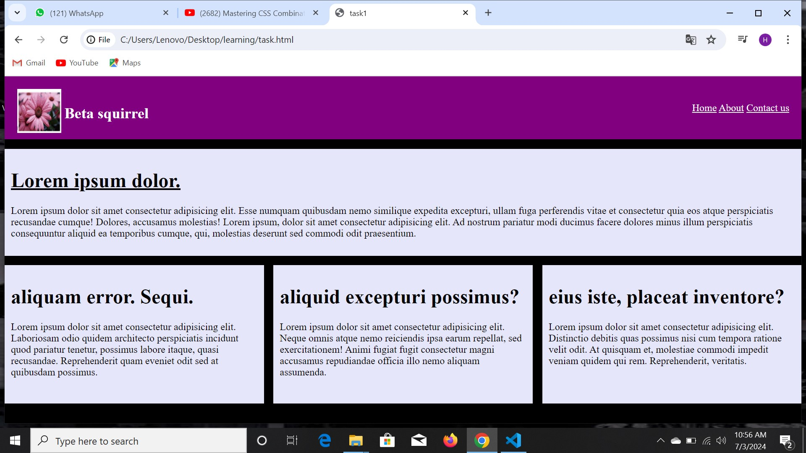
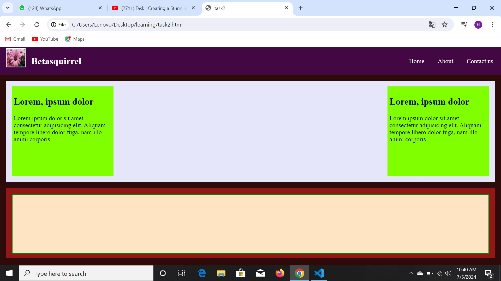

# Tasks
Assignments from betaquirrel
## First task

### Requirements
 | requirements             |output|
 |--------------------------|------|
 ||two   |
 ||two   |

Veniam sint excepteur et**sint incididunt** ea*aliqua enim* deserunt duis ~~ullamco~~ nostrud velit magna. Nostrud officia consectetur Lorem cillum qui pariatur ad est. Exercitation ad deserunt aliqua ea dolore mollit nisi sint.

`git commit`

## Linux commands

- `cd`-change current directory.ex:`cd desktop`,`cd..`
- `ls`-list content of a directory,ex:`ls-a`list hidden files as well
- `pwd`-display current working directory path
- `cat`-display content of a path,ex:`car README.md`

## Git commands

1. `git config` configure git user.ex:`git config--global user.name "hiba"`,`git config user.email "hibajabinkdy@gmail.com"`
2. `git clone` clone a remote git repo to your local.ex:`git clonehttps://github.com/hibajabin/tasks/blob/main/`
3. `git add` add your file changes to git.ex:`git add`,`git add readme.md`
4. `git commit` commit changes to git.ex:`git commit -m "initial commit"`
5. `git push` push your local commits to remote repo.ex:`git push origin main`

# Responsive Design Dimenions

- xs ( <576 )
- sm ( >=576 ) 
- md ( >=768 )
- lg ( >=992 )
- xl ( >=1200 )
- xxl ( >=1400 )

- mobile `@media only screen and (max-width : 767px){}`
- tablet `@media only screen and (max-width : 991px) and (min-width:768px){}`